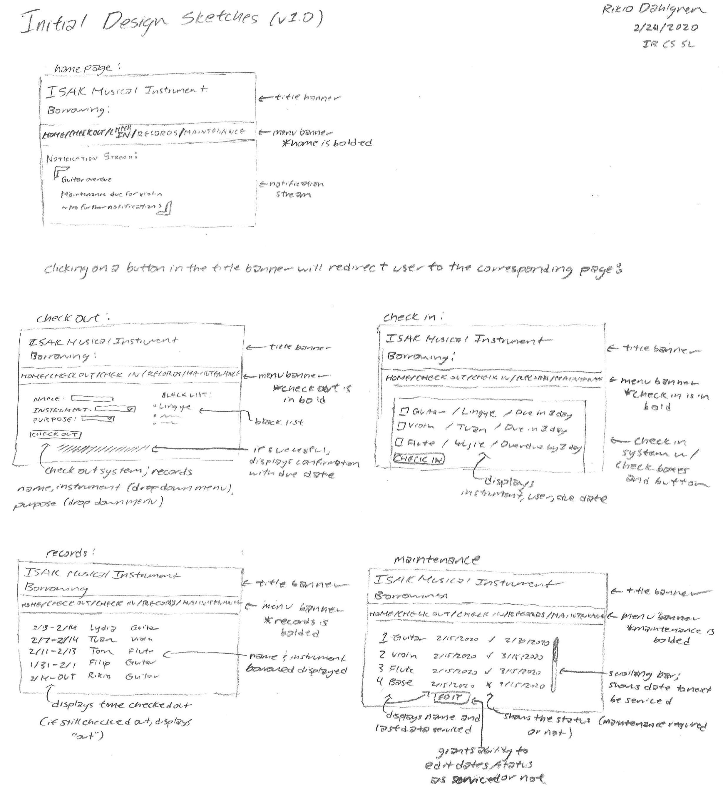
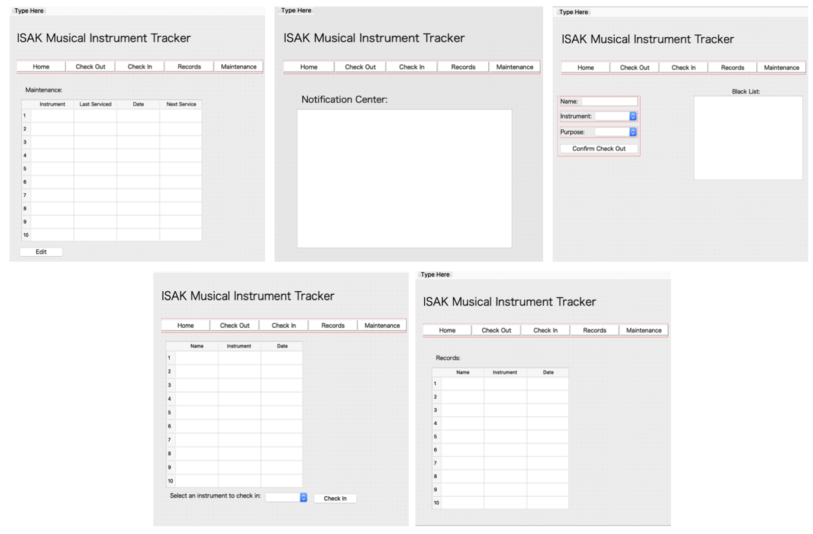

Criteria B: Development
=======================

### Early Development

**Fig. 1:** An initial design sketch of the program and its various pages. This was made after the first meeting with the client in which criteria for success were laid out. 

**Fig. 2:** The first rendition of the user interface for the program. While it is not functional, it is a good impression of what the program would look like. It features the five different screens as outlined in figure 1: home, check in, check out, maintenance, and records. 
